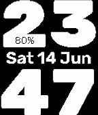

# bigTime

Pebble watchface that displays the time in a large format. Easy readability. Date is show relatively large. And battery percentage is tiny, always visibly on the foor of the hour 0/1/2.



## Build Instructions
See [Pebble SDK](https://developer.rebble.io)

```bash
nix-shell # I installed my SDK using Nix on MacOS
pebble build
pebble install --phone <your phone's IP>
pebble install --emulator aplite
```

## Changelog
- 1.2.0
    - added basic support for Chalk and Emery
    - battery bar
- 1.1.0
    - added hourly chime (double pulse vibrate)
- 1.0.0
    - initial release
    - 24-hour only
    - Rubik Mono One font for time (70px)
    - Rubik Semi Bold for date (24px)
    - Rubik Thin for battery percentage (14px)

## Roadmap
- [x] open source the code
- [ ] optimize memory by unload unused digit bitmaps
- [ ] add 12-hour support
- [ ] light mode
- [ ] user settings
    - toggle light/dark mode
    - toggle hourly chime
    - toggle battery percentage
    - 12/24 hour format
- [x] support more devices
    - Pebble Time Round (Chalk, 180x180)
    - Core Duo 2 (Emery, 200x280)